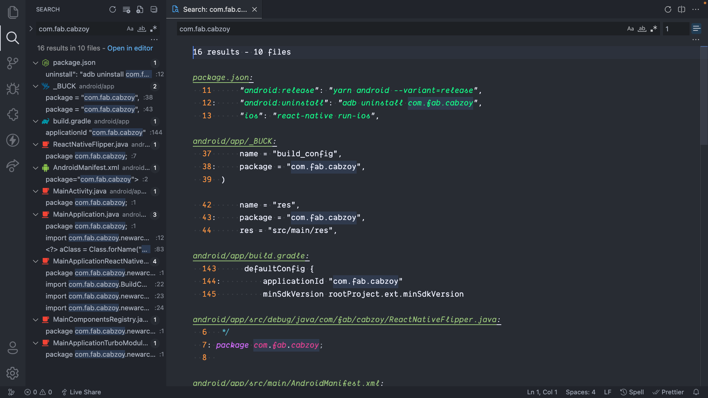

# Configure the App

### Rename Package Name

The package name of an Android app `uniquely identifies` your app on the device, in Google Play Store, and in supported third-party Android stores.

- Open your app source code (`user-app` or `driver-app`) folder in `vscode`.
- `Ctrl+Shift+F` or `CMD+Shift+F` to open `Universal Search`.
- Type `com.fab.cabzoy` and hit enter, you will find **16 results**.

:::caution
Enable `Match cases` turn on while searching.
:::

  

- Replace those with your own package name while register app on firebase like `com.example`.
