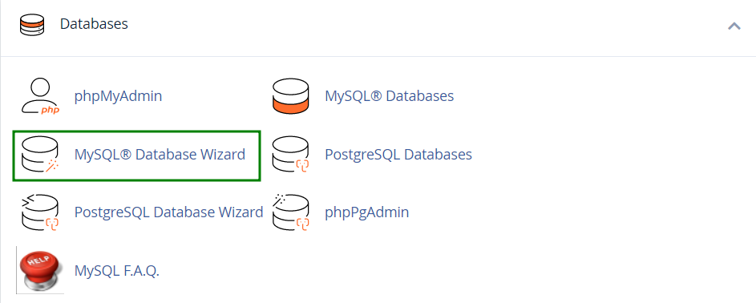
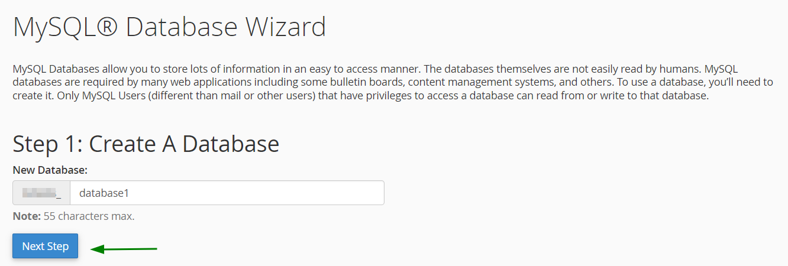
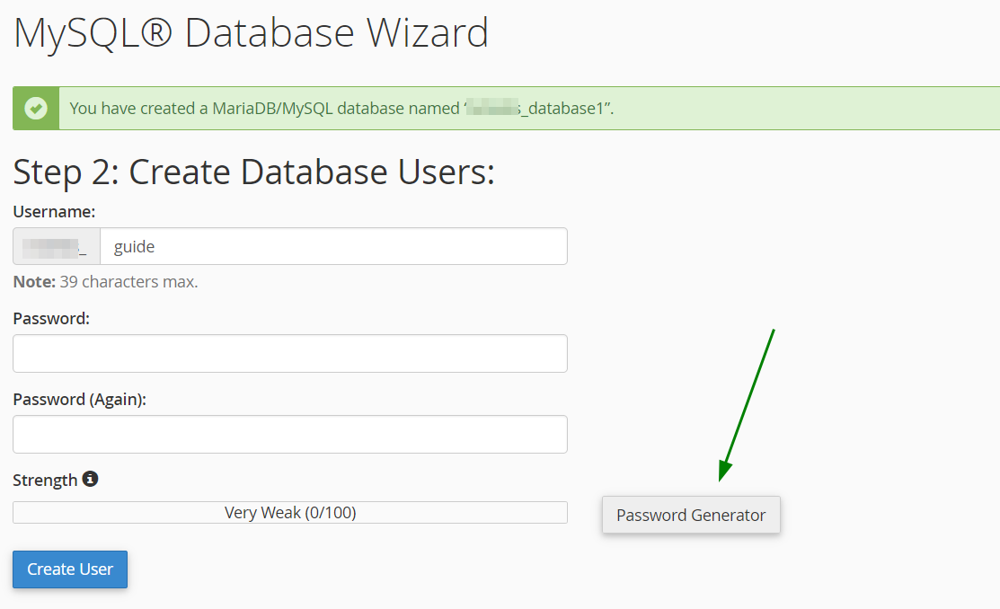
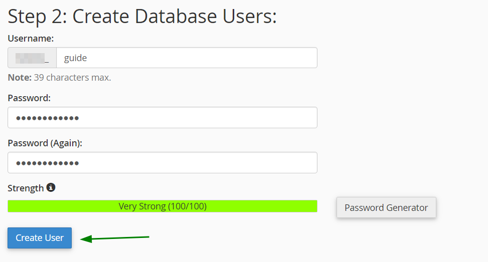
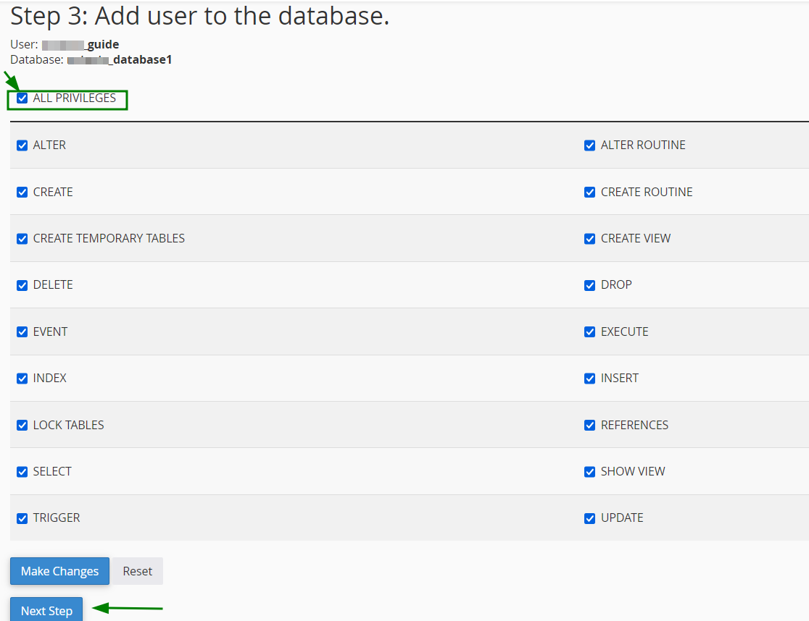
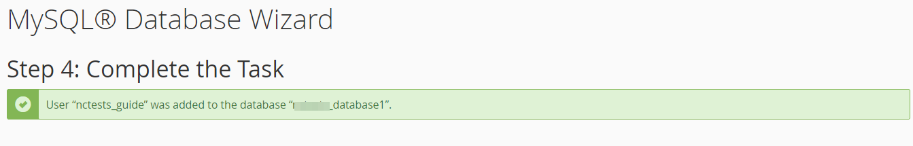

# Create a Database

Creating a database with the MySQL Database Wizard tool

- To find the tool, log into cPanel and click on the MySQL Database Wizard option under Databases:

  

- Once done, indicate the name of the new database and click on the Next Step button:

  

- At step 2 you will be prompted to indicate MySQL User and choose a password for it, reciprocally to the process described before:

  

- After the username and password are indicated, simply click on the Create User button:

  

- The next windows will allow you to set privileges for the newly created MySQL User similarly to the process described previously.

  Accordingly, you will need to choose the All Privileges option and click on the Next Step button after that:

  

- Once done, you will get a confirmation that the MySQL User was successfully added to the MySQL Database:

  

That's it.

:::caution

Please copy the database details (`database username`, `database password` & `database name`) because it will used in the installation.

:::
