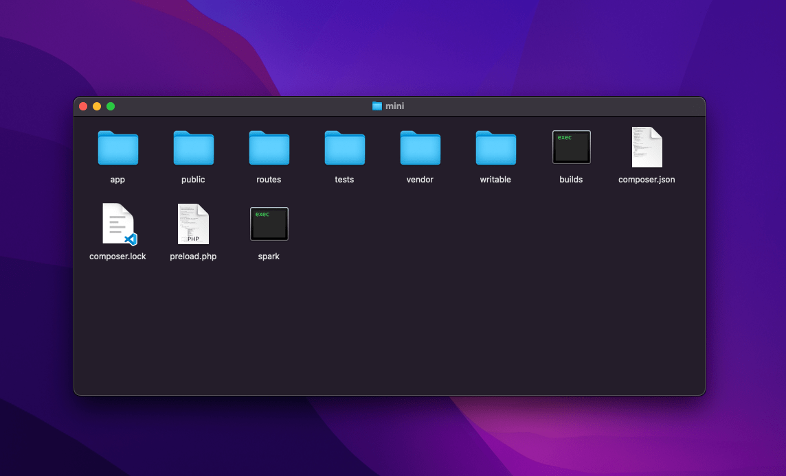

# Folder Structure

Extract `backend/**.zip` and open the folder.
In this folder you can see the structure.



:::info

`**.zip` is your only file inside **the `backend/` folder** like: `mini.zip`, `dispatch.zip`, `zone.zip`.

:::

```
.
├── app
│   ├── Apis
│   ├── Collectors
│   ├── Commands
│   ├── Common.php
│   ├── Config
│   ├── Controllers
│   ├── Database
│   │   ├── Migrations
│   │   └── Seeds
│   ├── Entities
│   ├── Filters
│   ├── Helpers
│   ├── Language
│   ├── Libraries
│   ├── Models
│   ├── ThirdParty
│   ├── Validations
│   │   └── CustomValidation.php
│   ├── Views
│   │   ├── components
│   │   ├── errors
│   │   ├── layouts
│   │   ├── pages
│   │   └── welcome_message.php
│   └── index.html
├── builds
├── composer.json
├── composer.lock
├── preload.php
├── public
├── routes
├── spark
├── tests
├── vendor
└── writable
    ├── cache
    ├── debugbar
    ├── logs
    ├── session
    └── uploads
```

