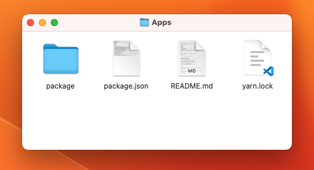

# Apps Folder Structure

Extract `apps/**.zip` and open the folder.
In this folder you can see the structure.



:::info

`**.zip` is your only file inside **the `apps/` folder** like: `Apps.zip`.

:::

```shell
package
    ├── cabzoy-driver-app
    │   ├── __tests__
    │   ├── android
    │   │   ├── app
    │   │   └── gradle
    │   └── src
    │       ├── assets
    │       ├── components
    │       ├── config
    │       ├── context
    │       ├── helpers
    │       ├── hooks
    │       ├── routes
    │       ├── screens
    │       ├── services
    │       ├── styles
    │       └── utilities
    └── cabzoy-user-app
        ├── __tests__
        ├── android
        │   ├── app
        │   └── gradle
        └── src
            ├── assets
            ├── components
            ├── config
            ├── context
            ├── helpers
            ├── hooks
            ├── routes
            ├── screens
            ├── services
            ├── styles
            └── utilities
```
