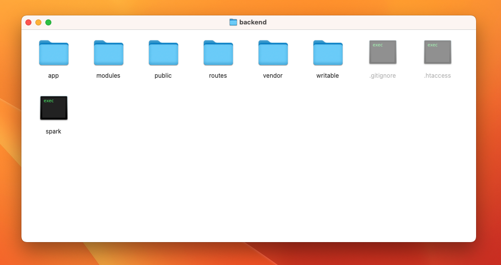

# Backend Folder Structure

Extract `backend/**.zip` and open the folder.
In this folder you can see the structure.



:::info

`**.zip` is your only file inside **the `backend/` folder** like: `backend.zip`, `mini.zip`, `dispatch.zip`, `zone.zip` & `pro.zip`.

:::

```shell
.
├── app
│   ├── Apis
│   ├── Collectors
│   ├── Commands
│   ├── Config
│   │   └── Boot
│   ├── Controllers
│   │   └── Fares
│   ├── Database
│   │   ├── Migrations
│   │   └── Seeds
│   ├── Entities
│   ├── Filters
│   ├── Helpers
│   ├── Language
│   │   └── en
│   ├── Libraries
│   ├── Models
│   ├── ThirdParty
│   ├── Validations
│   └── Views
│       ├── components
│       ├── errors
│       ├── layouts
│       └── pages
├── modules
│   └── corporate
│       ├── Controllers
│       ├── Database
│       ├── Entities
│       ├── Helpers
│       ├── Models
│       ├── Views
│       └── routes
├── public
│   ├── assets
│   │   ├── css
│   │   ├── img
│   │   ├── js
│   │   └── vendors
│   └── uploads
│       ├── settings
│       └── users
├── routes
├── vendor
│   ├── codeigniter4
│   │   └── framework
│   ├── composer
│   ├── daycry
│   │   └── relations
│   ├── laminas
│   │   └── laminas-escaper
│   ├── myth
│   │   └── auth
│   ├── psr
│   │   └── log
│   └── tatter
│       ├── schemas
│       └── settings
└── writable
    ├── cache
    ├── debugbar
    ├── logs
    ├── session
    └── uploads
```
