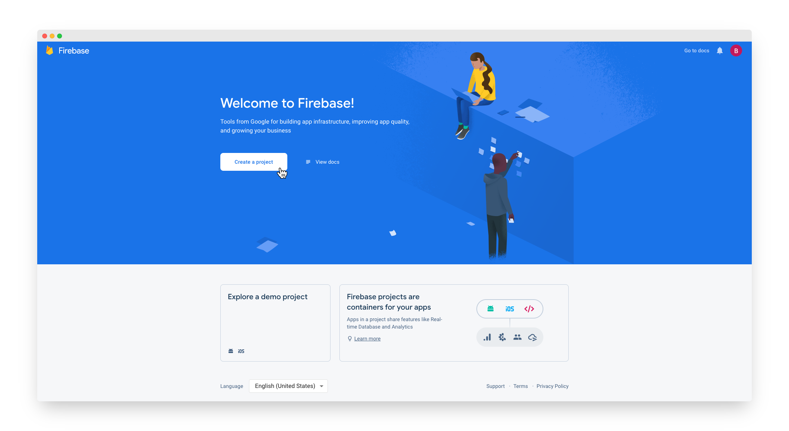
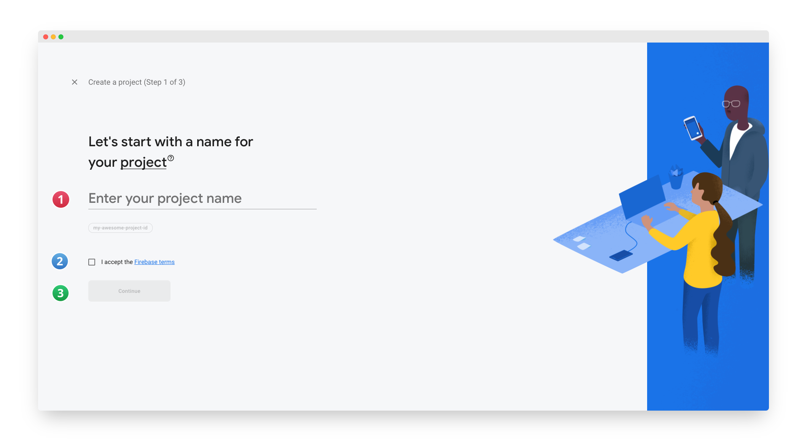
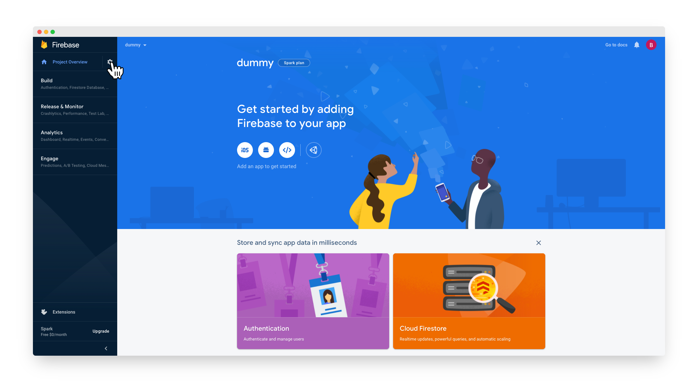
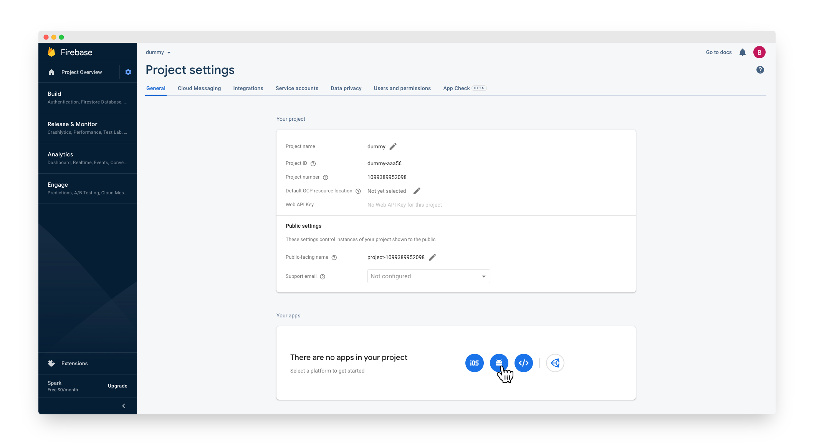
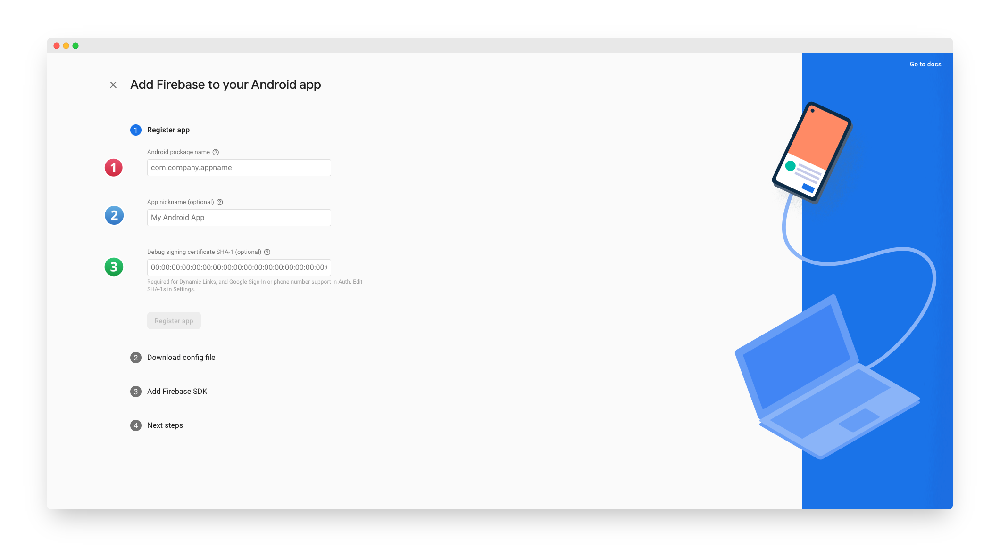

# Firebase Account

## Create Project

- Create a [Firebase account](https://console.firebase.google.com/) or log into [an existing account](https://console.firebase.google.com/).
- Click **"Add project"**. If it's your first time on the page, click **"Create a project"**.

  

- After Click, You will see 

   1. Enter your project name.
   2. Checked or click **"I accept the Firebase Terms"**.
   3. Follow the remaining setup steps and then click Create project.

:::info
You don't need to enable Google Analytics for this project. It's all depend on you.
:::

- After the wizard provisions your project, click **"Continue"**.
- In the **"Project Overview page"** of your project, click **"Settings"** and then click **"Project settings"**.

  

- Click the **"Android icon"**, which brings you to the Add Firebase to your Android app page.

  

- After Click, You will see 

  1. In **"Android package name"**, enter your package name like *"com.example.app"*.
  2. App Nickname is optional.
  3. In **"Debug signing certificate SHA-1"**, enter the SHA-1 value of your debug sha-1.

:::info
How to generate **Keystore file** or How to get **SHA-1 Value**?

[click here](https://developers.google.com/android/guides/client-auth) to more details.
:::

- After filling, Click **"Register app"**.
- Follow the steps in the **"Download config file section"** to add the *google-services.json* file to your project.
- Click **"Next"** in the **"Download config file section"**.
- Click **"Next"** in the **"Add Firebase SDK section"**.
- Click **"Continue"** to console to complete the setup.