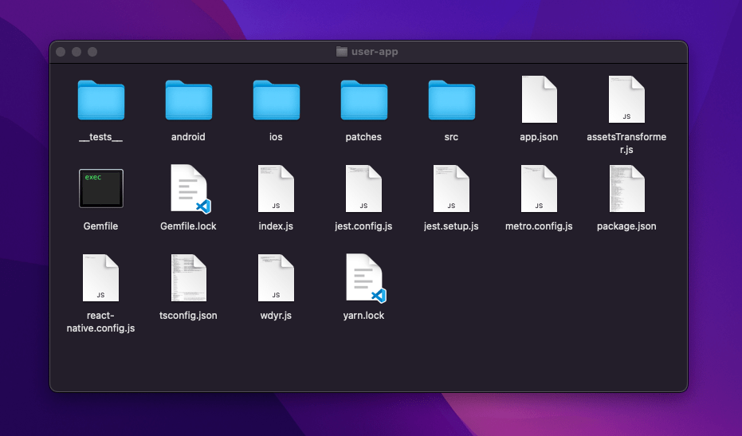

# Folder Structure

Extract `apps/**.zip` and open the folder.
In this folder you can see the structure.



:::info

`user-app.zip` & `driver-app.zip` both apps have similar way of the installation.

:::

```
.
├── Gemfile
├── Gemfile.lock
├── __tests__
│   └── App-test.tsx
├── android
│   ├── app
│   │   ├── _BUCK
│   │   ├── build.gradle
│   │   ├── build_defs.bzl
│   │   ├── debug.keystore
│   │   ├── proguard-rules.pro
│   │   └── src
│   ├── build.gradle
│   ├── gradle
│   │   └── wrapper
│   ├── gradle.properties
│   ├── gradlew
│   ├── gradlew.bat
│   ├── local.properties
│   └── settings.gradle
├── app.json
├── assetsTransformer.js
├── index.js
├── jest.config.js
├── jest.setup.js
├── metro.config.js
├── package.json
├── patches
│   ├── react-native-floating-bubble+1.0.7.patch
│   └── react-native-maps-directions+1.8.0.patch
├── react-native.config.js
├── src
│   ├── assets
│   │   ├── icons
│   │   ├── images
│   │   ├── index.ts
│   │   └── video
│   ├── components
│   │   ├── Announcement
│   │   ├── Block
│   │   ├── Button
│   │   ├── Card
│   │   ├── ConditionalFragment
│   │   ├── Container
│   │   ├── ErrorPlaceholder
│   │   ├── ImageContainer
│   │   ├── Inline
│   │   ├── Input
│   │   ├── Link
│   │   ├── Loader
│   │   ├── Map
│   │   ├── Picker
│   │   ├── PlacesAutoComplete
│   │   ├── Typography
│   │   └── index.ts
│   ├── config
│   │   ├── api.config.ts
│   │   ├── config.ts
│   │   ├── index.ts
│   │   ├── map.config.ts
│   │   ├── placeholder.config.ts
│   │   └── theme.config.ts
│   ├── context
│   │   ├── index.tsx
│   │   ├── location.context.tsx
│   │   ├── network.context.tsx
│   │   └── theme.context.tsx
│   ├── helpers
│   │   ├── appsetting.helper.ts
│   │   ├── array.helper.ts
│   │   ├── index.ts
│   │   ├── number.helper.ts
│   │   ├── space.helper.ts
│   │   ├── string.helper.ts
│   │   ├── time.helper.ts
│   │   └── validate.helpers.ts
│   ├── hooks
│   │   ├── index.ts
│   │   ├── useForm.ts
│   │   ├── useInterval.ts
│   │   ├── useMountEffect.ts
│   │   ├── useNotification.ts
│   │   ├── usePostRequest.ts
│   │   ├── useRequest.ts
│   │   ├── useSmartState.ts
│   │   ├── useStorage.ts
│   │   └── useTimeout.ts
│   ├── index.tsx
│   ├── routes
│   │   ├── AuthStackContainer.tsx
│   │   ├── MapStackContainer.tsx
│   │   ├── NativeStackContainer.tsx
│   │   ├── NavigationContainer.tsx
│   │   └── index.tsx
│   ├── screens
│   │   ├── Account
│   │   ├── Auth
│   │   ├── Card
│   │   ├── Category
│   │   ├── ChooseOnMap
│   │   ├── Document
│   │   ├── Edit
│   │   ├── Families
│   │   ├── Fare
│   │   ├── Fuel
│   │   ├── Home
│   │   ├── ImageUpload
│   │   ├── LocationSelector
│   │   ├── Map
│   │   ├── Money
│   │   ├── Notification
│   │   ├── OrderDetail
│   │   ├── Orders
│   │   ├── Permission
│   │   ├── PlaceSelector
│   │   ├── Profile
│   │   ├── ReferUsers
│   │   ├── SendMoney
│   │   ├── Splash
│   │   ├── ThanksScreen
│   │   ├── Tips
│   │   ├── Wallet
│   │   ├── WebView
│   │   ├── Withdraw
│   │   └── index.ts
│   ├── services
│   │   ├── api
│   │   ├── bubble.ts
│   │   ├── index.ts
│   │   └── notification
│   ├── styles
│   │   ├── colors.ts
│   │   ├── image.ts
│   │   └── index.ts
│   └── utilities
│       ├── index.ts
│       ├── location.ts
│       ├── log.ts
│       ├── permissions.ts
│       ├── toast.ts
│       └── types
├── tsconfig.json
├── wdyr.js
└── yarn.lock
```

