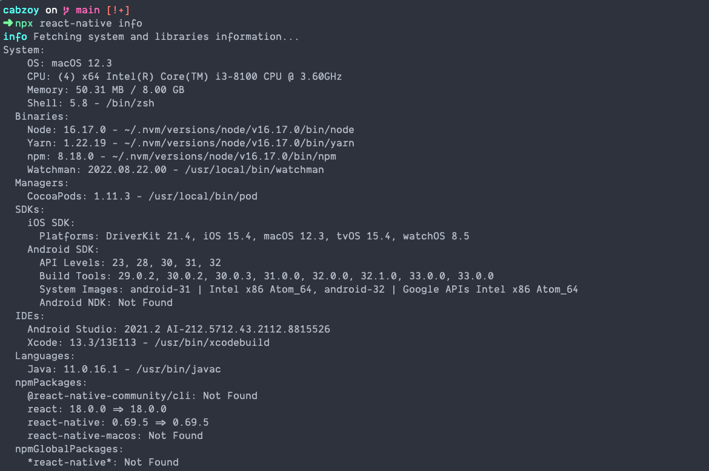

# Testing & Run the App

### Check Dependencies

For the successfully make the App build, we need to check our project details.

```bash
npx react-native info
```

After run above command, we see output like this:



If your output similar to above image, then we are good to go.