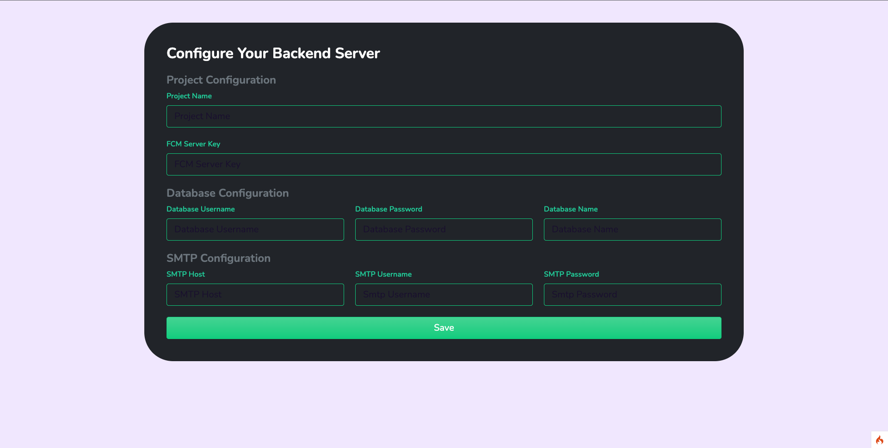
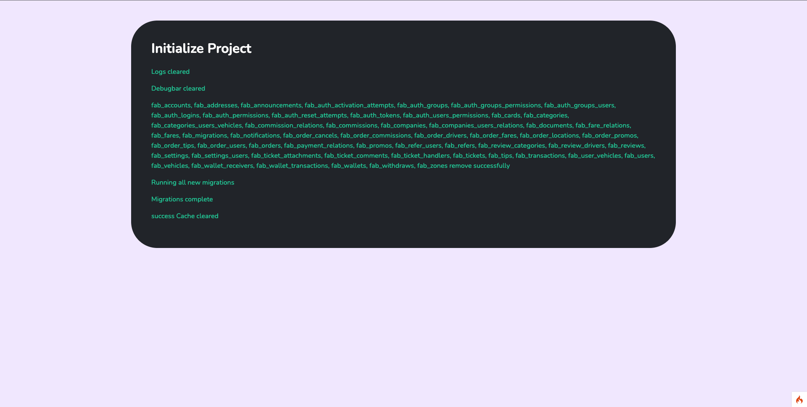

# New Features 🔥

### The Backend Setup Wizard

WordPress like setup is now available in the **`Cabzoy CMS`**. Just Three step to go live with your backend.

1. Upload your backend to the server.
2. Open your backend server url.
3. Fill the details and it's done.

### Here's the Preview

:::info
The wizard auto create the tables and import quick start data. also clear the cache, logs, sessions and others files.
This is the one tools to make your life easier.
:::

:::note
Hey guys,

It's on the `alpha release` after few more testing and it's available on the `CodeCanyon`.
:::