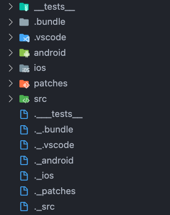

# Invalid Files or Duplicate Files

If you see the duplicate files in your code editor or getting error of `Invalid Files` while making the debug build, delete the duplicate file starts with `._` eg. `._src`, `._android`.

It's look like these.

